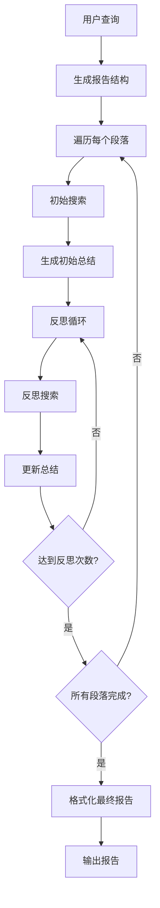
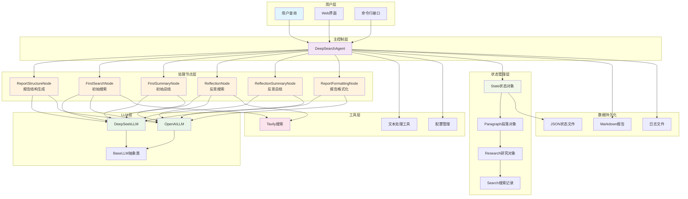

# Deep Search Agent

[](https://python.org)
[](LICENSE)
[](https://platform.deepseek.com/)
[](https://tavily.com/)

一个**无框架**的深度搜索AI代理实现，能够通过多轮搜索和反思生成高质量的研究报告。

## 特性

- **无框架设计**: 从零实现，不依赖LangChain等重型框架
- **多LLM支持**: 支持DeepSeek、OpenAI等主流大语言模型
- **智能搜索**: 集成Tavily搜索引擎，提供高质量网络搜索
- **反思机制**: 多轮反思优化，确保研究深度和完整性
- **状态管理**: 完整的研究过程状态跟踪和恢复
- **Web界面**: Streamlit友好界面，易于使用
- **Markdown输出**: 美观的Markdown格式研究报告

## 工作原理

Deep Search Agent采用分阶段的研究方法：



### 核心流程

1. **结构生成**: 根据查询生成报告大纲和段落结构
2. **初始研究**: 为每个段落生成搜索查询并获取相关信息
3. **初始总结**: 基于搜索结果生成段落初稿
4. **反思优化**: 多轮反思，发现遗漏并补充搜索
5. **最终整合**: 将所有段落整合为完整的Markdown报告

## 快速开始

### 1. 环境准备

确保您的系统安装了Python 3.9或更高版本：

```bash
python --version
```

### 2. 克隆项目

```bash
git clone <your-repo-url>
cd Demo\ DeepSearch\ Agent
```

### 3. 安装依赖

```bash
# 激活虚拟环境（推荐）
conda activate pytorch_python11  # 或者使用其他虚拟环境

# 安装依赖
pip install -r requirements.txt
```

### 4. 配置API密钥

复制配置文件模板：

```bash
cp config.env.example config.env
```

编辑`config.env`文件，设置您的API密钥：

```env
# DeepSeek API Key（推荐）
DEEPSEEK_API_KEY=your_deepseek_api_key_here

# Tavily搜索API Key（必需）
TAVILY_API_KEY=your_tavily_api_key_here

# OpenAI API Key（可选）
OPENAI_API_KEY=your_openai_api_key_here

# 配置参数
MAX_REFLECTIONS=2
SEARCH_RESULTS_PER_QUERY=3
SEARCH_CONTENT_MAX_LENGTH=20000
```

### 5. 开始使用

现在您可以开始使用Deep Search Agent了！

## 使用方法

### 基本使用

```python
from src import DeepSearchAgent, load_config

# 加载配置
config = load_config()

# 创建Agent
agent = DeepSearchAgent(config)

# 执行研究
query = "2025年人工智能发展趋势"
final_report = agent.research(query, save_report=True)

print(final_report)
```

### 自定义配置

```python
from src import DeepSearchAgent, Config

# 自定义配置
config = Config(
    default_llm_provider="deepseek",
    deepseek_model="deepseek-chat",
    max_reflections=3,           # 增加反思次数
    max_search_results=5,        # 增加搜索结果数
    output_dir="my_reports"      # 自定义输出目录
)

# 设置API密钥
config.deepseek_api_key = "your_api_key"
config.tavily_api_key = "your_tavily_key"

agent = DeepSearchAgent(config)
```


## 项目结构

```
Demo DeepSearch Agent/
├── src/                          # 核心代码
│   ├── llms/                     # LLM调用模块
│   │   ├── base.py              # LLM基类
│   │   ├── deepseek.py          # DeepSeek实现
│   │   └── openai_llm.py        # OpenAI实现
│   ├── nodes/                    # 处理节点
│   │   ├── base_node.py         # 节点基类
│   │   ├── report_structure_node.py  # 结构生成
│   │   ├── search_node.py       # 搜索节点
│   │   ├── summary_node.py      # 总结节点
│   │   └── formatting_node.py   # 格式化节点
│   ├── prompts/                  # 提示词模块
│   │   └── prompts.py           # 所有提示词定义
│   ├── state/                    # 状态管理
│   │   └── state.py             # 状态数据结构
│   ├── tools/                    # 工具调用
│   │   └── search.py            # 搜索工具
│   ├── utils/                    # 工具函数
│   │   ├── config.py            # 配置管理
│   │   └── text_processing.py   # 文本处理
│   └── agent.py                 # 主Agent类
├── examples/                     # 使用示例
│   ├── basic_usage.py           # 基本使用示例
│   ├── advanced_usage.py        # 高级使用示例
│   └── streamlit_app.py         # Web界面
├── reports/                      # 输出报告目录
├── requirements.txt              # 依赖列表
├── config.env.example           # 配置文件模板
└── README.md                    # 项目文档
```

## 代码结构



## API 参考

### DeepSearchAgent

主要的Agent类，提供完整的深度搜索功能。

```python
class DeepSearchAgent:
    def __init__(self, config: Optional[Config] = None)
    def research(self, query: str, save_report: bool = True) -> str
    def get_progress_summary(self) -> Dict[str, Any]
    def load_state(self, filepath: str)
    def save_state(self, filepath: str)
```

### Config

配置管理类，控制Agent的行为参数。

```python
class Config:
    # API密钥
    deepseek_api_key: Optional[str]
    openai_api_key: Optional[str] 
    tavily_api_key: Optional[str]
    
    # 模型配置
    default_llm_provider: str = "deepseek"
    deepseek_model: str = "deepseek-chat"
    openai_model: str = "gpt-4o-mini"
    
    # 搜索配置
    max_search_results: int = 3
    search_timeout: int = 240
    max_content_length: int = 20000
    
    # Agent配置
    max_reflections: int = 2
    max_paragraphs: int = 5
```

## 示例

### 示例1：基本研究

```python
from src import create_agent

# 快速创建Agent
agent = create_agent()

# 执行研究
report = agent.research("量子计算的发展现状")
print(report)
```

### 示例2：自定义研究参数

```python
from src import DeepSearchAgent, Config

config = Config(
    max_reflections=4,        # 更深度的反思
    max_search_results=8,     # 更多搜索结果
    max_paragraphs=6          # 更长的报告
)

agent = DeepSearchAgent(config)
report = agent.research("人工智能的伦理问题")
```

### 示例3：状态管理

```python
# 开始研究
agent = DeepSearchAgent()
report = agent.research("区块链技术应用")

# 保存状态
agent.save_state("blockchain_research.json")

# 稍后恢复状态
new_agent = DeepSearchAgent()
new_agent.load_state("blockchain_research.json")

# 检查进度
progress = new_agent.get_progress_summary()
print(f"研究进度: {progress['progress_percentage']}%")
```

## 高级功能

### 多模型支持

```python
# 使用DeepSeek
config = Config(default_llm_provider="deepseek")

# 使用OpenAI
config = Config(default_llm_provider="openai", openai_model="gpt-4o")
```

### 自定义输出

```python
config = Config(
    output_dir="custom_reports",           # 自定义输出目录
    save_intermediate_states=True          # 保存中间状态
)
```

### Web界面

启动Streamlit Web界面：

```bash
streamlit run examples/streamlit_app.py
```

界面提供：
- 实时进度跟踪
- 动态配置调整
- 报告下载功能
- 搜索历史查看
- 状态文件管理

## 常见问题

### Q: 支持哪些LLM？

A: 目前支持：
- **DeepSeek**: 推荐使用，性价比高
- **OpenAI**: GPT-4o、GPT-4o-mini等
- 可以通过继承`BaseLLM`类轻松添加其他模型

### Q: 如何获取API密钥？

A: 
- **DeepSeek**: 访问 [DeepSeek平台](https://platform.deepseek.com/) 注册获取
- **Tavily**: 访问 [Tavily](https://tavily.com/) 注册获取（每月1000次免费）
- **OpenAI**: 访问 [OpenAI平台](https://platform.openai.com/) 获取

### Q: 研究报告质量如何提升？

A: 可以通过以下方式优化：
- 增加`max_reflections`参数（更多反思轮次）
- 增加`max_search_results`参数（更多搜索结果）
- 调整`max_content_length`参数（更长的搜索内容）
- 使用更强大的LLM模型

### Q: 如何自定义提示词？

A: 修改`src/prompts/prompts.py`文件中的系统提示词，可以根据需要调整Agent的行为。

### Q: 支持其他搜索引擎吗？

A: 当前主要支持Tavily，但可以通过修改`src/tools/search.py`添加其他搜索引擎支持。

## 贡献

欢迎贡献代码！请遵循以下步骤：

1. Fork本项目
2. 创建特性分支 (`git checkout -b feature/AmazingFeature`)
3. 提交更改 (`git commit -m 'Add some AmazingFeature'`)
4. 推送到分支 (`git push origin feature/AmazingFeature`)
5. 开启Pull Request

## 许可证

本项目采用MIT许可证 - 查看 [LICENSE](LICENSE) 文件了解详情。

## 致谢

- 感谢 [DeepSeek](https://www.deepseek.com/) 提供优秀的LLM服务
- 感谢 [Tavily](https://tavily.com/) 提供高质量的搜索API

---

如果这个项目对您有帮助，请给个Star！
